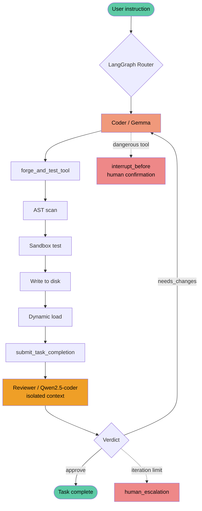

# Daedalus 🕶️

> Smart, Knowledgeable and Powerful Agent by Oakley

Daedalus is a locally-deployed autonomous AI agent system. It detects capability gaps in a task, autonomously writes Python tool code in the background, runs static safety analysis and sandboxed tests, then physically writes the tool to its library and dynamically loads it, continuously expanding its own capabilities. All inference runs locally through Ollama, and no data leaves the machine.

The core of the system is a "self-development + independent review" mechanism: the Coder (which writes code) and the Reviewer (which audits it) are two models of independent lineage. The Reviewer re-examines the code in an isolated context to avoid shared blind spots, summarizes any issues found in real time, and drives automatic revision until the task passes.

## Architecture



## Core Features

**Autonomous Tool Development**
The Coder writes Python tools on demand. After passing safety checks and tests, the code is physically written to `custom_tools.py` and loaded via `importlib.reload`, making new tools available without a restart.

**Multi-layer Safety**
- AST static analysis: scans code before writing, blocking dangerous operations (`import`, `exec`, `eval`, indirect `__import__` bypass, accessing `__builtins__` via `getattr`, etc.)
- Sandbox isolation: code runs its unit tests in an isolated environment first; only tests that pass are allowed to write to disk
- Three-stage status tracking: AST scan, sandbox test, and disk write each report independently, eliminating the confusion of treating "tests passed" as "successfully written"

**Enforced Structured Reporting**
The Coder must submit a structured report via `submit_task_completion` (files changed, test results, risk level). Plain-text "pretending to be done" is forbidden, eliminating hallucination at the mechanism level. If the Coder is detected merely displaying code in text without actually calling the tool, it is intercepted and required to use the proper workflow.

**Independent Reviewer Agent**
- Uses a model of different lineage from the Coder (Reviewer uses `qwen2.5-coder`, Coder uses `gemma`) to avoid shared training-level blind spots
- Fully isolated: the Reviewer cannot see the Coder's reasoning, and judges solely on the original task requirement plus the machine-extracted actual code
- Reads the actual `test_code` directly (not the Coder's self-reported summary), so it can detect weakened or gamed tests
- Review dimensions cover: task conformance, security vulnerabilities, edge cases, and test validity

**Automatic Revision Loop**
When the Reviewer finds issues, it automatically sends them back to the Coder for revision and re-review, until the task passes or a limit is reached, fully automatic with no step-by-step human approval. A "selective amnesia" mechanism removes stale reasoning on retry while preserving objective execution results and already-created function names, preventing the Coder from clinging to a wrong direction or duplicating functions.

**Real-time Transparency**
The interface shows the full trace in real time: what the Coder plans to do, its work in progress, the three-stage forge result, the Reviewer's audit card (target, risk level, checklist, verdict), and a final task summary.

**Human-in-the-loop for Dangerous Operations**
Irreversible operations (deleting local videos, uploading to YouTube, etc.) force a human confirmation prompt and only execute on approval.

**Runaway Protection**
When a task exceeds the iteration limit (6 rounds), it is forcibly halted and escalated to human intervention, preventing infinite loops from exhausting resources.

## Spin-off Application: Japanese Vocabulary Video Factory

Daedalus's capabilities extend into an automated Japanese learning content pipeline:

- Autonomously searches word-frequency data for common Japanese words, excluding those already in the database
- The agent decides on its own whether each word needs an etymology breakdown (e.g. compound words, loanword transliterations)
- Renders 1920x1080 cards with Pillow, synthesizes multi-track audio with edge-tts (Japanese, Chinese, Japanese, etymology)
- Generates per-word clips with MoviePy and concatenates them, writing temp files immediately to avoid container OOM
- Uploads videos to YouTube then deletes local files; the database stores only the link, so large videos never accumulate locally
- Writes structured word data into a SQLite encyclopedia database

## Tech Stack

| Category | Technology |
| --- | --- |
| Language | Python 3.10 |
| Agent framework | LangGraph (state-machine routing), LangChain (tool binding, model integration) |
| Local models | Ollama, Gemma (Coder), Qwen2.5-coder (Reviewer) |
| Frontend | Chainlit |
| Safety analysis | AST static analysis, unittest sandbox, importlib dynamic loading |
| Data | Pydantic (structured report schema), SQLite (encyclopedia database) |
| Deployment | Docker (volume mount, `host.docker.internal` to reach local Ollama) |
| Media | MoviePy, Pillow, edge-tts, YouTube Data API v3 |

## Setup and Run

### Prerequisites

- Docker
- A running local Ollama with the required models pulled:

```bash
ollama pull gemma3:27b
ollama pull qwen2.5-coder:7b
```

(Match the exact model tags to the settings in `agent.py`.)

### Configuration

1. Create `.env` and set the Ollama endpoint:

```
OLLAMA_BASE_URL=http://host.docker.internal:11434
```

2. To use YouTube upload, place OAuth credentials in `secrets/` (this folder is excluded by `.gitignore` and will not be committed).

### Build and Start

```bash
docker build -t daedalus .

docker run -d \
  --name daedalus_run \
  -p 8000:8000 \
  -v "$(pwd):/app" \
  --env-file .env \
  daedalus
```

Then open `http://localhost:8000` in a browser.

> Note: after editing `agent.py` or `app.py`, run `docker restart daedalus_run`. The volume mount syncs files, but the running Python process does not auto-reload.

## Testing

Several test scripts are included. Run them inside the container to match the production environment:

```bash
# Security tests (AST interception, command injection, gamed-test detection, runaway protection)
docker exec daedalus_run python /app/scripts/run_security_tests.py

# Structured report schema tests
docker exec daedalus_run python /app/scripts/run_schema_tests.py

# Reviewer audit capability tests
docker exec daedalus_run python /app/scripts/run_reviewer_tests.py

# Unit tests
docker exec daedalus_run python -m pytest
```

## Project Structure

```
Daedalus/
├── agent.py              # LangGraph state machine, Coder/Reviewer logic, forge tool
├── app.py                # Chainlit frontend, human-in-the-loop, streaming display
├── custom_tools.py       # AI self-developed tool library (dynamically expanded)
├── encyclopedia.py       # Japanese encyclopedia database module
├── run.py                # Script to test the agent locally
├── Dockerfile
├── requirements.txt
├── docs/                 # Design documents
└── scripts/              # Test and helper scripts
```

## Design Document

The full design decisions for the review mechanism are recorded in `docs/structured-reporting-and-reviewer-design.md`, including the structured report schema, Reviewer isolation design, the revision loop, and the model selection process.
